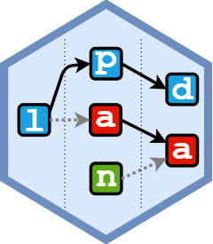

<!-- README.md is generated from README.Rmd. Please edit that file -->

```{r, include = FALSE}
knitr::opts_chunk$set(
  collapse = TRUE,
  comment = "#>",
  fig.path = "man/figures/README-",
  out.width = "100%"
)
```

# lpanda <a href="https://localpolitics.github.io/lpanda/"></a>
Local Political Actor Network Diachronic Analysis Tools

<!-- badges: start -->
[](https://github.com/localpolitics/lpanda/actions/workflows/R-CMD-check.yaml)
[](https://app.codecov.io/gh/localpolitics/lpanda)
[](https://CRAN.R-project.org/package=lpanda)
[](https://CRAN.R-project.org/package=lpanda)
[](https://doi.org/10.32614/CRAN.package.lpanda)
[](https://doi.org/10.5281/zenodo.17049363)
<!-- badges: end -->


## Overview

The R package 'lpanda' provides tools for preparing, analyzing and visualizing
diachronic network data from municipal election results. It is designed to make
it easier to study local political actor networks, with a particular focus
on the development of local party systems' format, especially in small
municipalities.


## Installation

You can install the released version of `lpanda` from CRAN with:

``` r
install.packages("lpanda")
```

Or install the development version from [GitHub](https://github.com/) with:

``` r
devtools::install_github("localpolitics/lpanda")
```


## Usage

To create a basic continuity diagram of candidacies of local political actors,
it is necessary to prepare data containing at least unique names of candidates
(if they are the same, they need to be distinguished, e.g. by adding 'jr.' or
numbers after the names of candidates - for example: 'John Smith (2)'), the year
of the election and the name of the candidate list they ran for. Then, just use
the 'plot_continuity()' function.

```{r basic_continuity_diagram, echo = TRUE}
library(lpanda)
## basic example code
data(sample_data, package = "lpanda")
df <- sample_data
lpanda::plot_continuity(df)
```

However, the usefulness of the package lies in the simplicity of converting basic
data into network data, which can be used not only with the `lpanda` package, but
also with other packages for social network analysis.

The following example shows how raw data is converted to network data. The output
is a list of networks that contain edgelist and node attributes that can be directly
used for social network analysis. The last item contains statistics of the included
elections.

```{r converting_raw_data}
netdata <- lpanda::prepare_network_data(sample_data)

str(netdata, max.level = 2)

# election stats
print(netdata$elections$node_attr)
```

For diachronic analysis of the continuity of candidacies of local political
actors, a number of parameters in the `plot_continuity()` function can be used
(see `?plot_continuity`), which will help identify political parties (clusters
of candidate lists), e.g., for calculating the stability of the party system
using one of the volatility indices, or for tracking candidacies of a specific
political actor.

```{r continuity_use, echo = TRUE}
netdata <- lpanda::prepare_network_data(sample_data, verbose = FALSE)

# identified "political parties"
plot_continuity(netdata, mark = "parties", separate_groups = TRUE,
                do_not_print_to_console = TRUE)

# tracking the candidacies of candidate "c03"
plot_continuity(netdata, mark = c("candidate", "c03"),
                do_not_print_to_console = TRUE)

```
