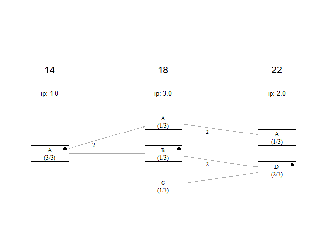
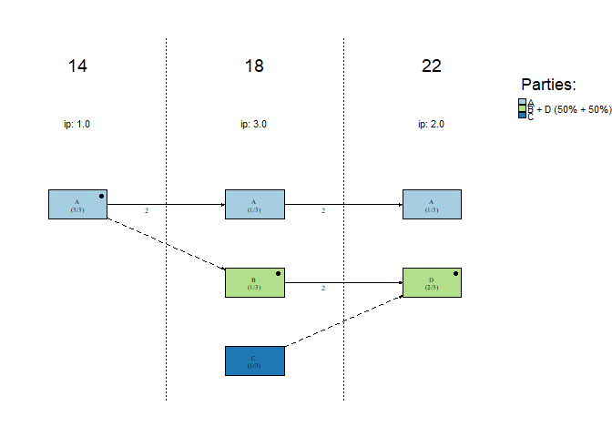
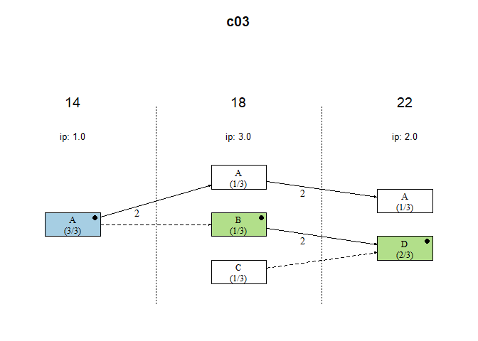

<!-- README.md is generated from README.Rmd. Please edit that file -->

# lpanda

<!-- badges: start -->

[](https://github.com/localpolitics/lpanda/actions/workflows/R-CMD-check.yaml)
<!-- badges: end -->

## Overview

The R package ‘lpanda’ provides functions to prepare, visualize, and
analyse diachronic network data on local political actors, with a
particular focus on the development of local party systems’ format and
identification of actor groups.

## Installation

From CRAN (soon):

``` r
install.packages("lpanda")
```

You can install the development version of `lpanda` from
[GitHub](https://github.com/) with:

``` r
devtools::install_github("localpolitics/lpanda")
```

## Usage

To create a basic continuity diagram of candidacies of local political
actors, it is necessary to prepare data containing at least unique names
of candidates (if they are the same, they need to be distinguished,
e.g. by adding ‘jr.’ or numbers after the names of candidates - for
example: ‘John Smith (2)’), the year of the election and the name of the
candidate list they ran for. Then, just use the ‘plot_continuity()’
function.

``` r
library(lpanda)
## basic example code
data(sample_data, package = "lpanda")
df <- sample_data
lpanda::plot_continuity(df)
```



However, the usefulness of the package lies in the simplicity of
converting basic data into network data, which can be used not only with
the `lpanda` package, but also with other packages for social network
analysis.

The following example shows how raw data is converted to network data.
The output is a list of networks that contain edgelist and node
attributes that can be directly used for social network analysis. The
last item contains statistics of the included elections.

``` r
netdata <- lpanda::prepare_network_data(sample_data)
#> ==========================================================
#> Preparing Network Data for LPANDA
#> ==========================================================
#> 
#> 1/ Checking the usability of input data and modifying it for
#>    conversion to network data.
#> Column 'const_size' was missing and will be created based on 'elected'.
#> const_size was calculated from 'elected' for elections: 14, 18, 22.
#>    Done.
#> 2/ Creating an edgelist of a bimodal network. Done.
#> 3/ Projecting a bimodal network and building edgelists for
#>    the following networks: candidates, candidate lists,
#>    continuity and elections. Done.
#> 4/ Detecting 'political parties' (may take a while):
#>   |                                                          |                                                  |   0%  |                                                          |■                                                 |   1%  |                                                          |■                                                 |   2%  |                                                          |■■                                                |   4%  |                                                          |■■                                                |   5%  |                                                          |■■■                                               |   6%  |                                                          |■■■■                                              |   8%  |                                                          |■■■■                                              |   9%  |                                                          |■■■■■                                             |  10%  |                                                          |■■■■■■                                            |  11%  |                                                          |■■■■■■                                            |  12%  |                                                          |■■■■■■■                                           |  14%  |                                                          |■■■■■■■■                                          |  15%  |                                                          |■■■■■■■■                                          |  16%  |                                                          |■■■■■■■■■                                         |  18%  |                                                          |■■■■■■■■■                                         |  19%  |                                                          |■■■■■■■■■■                                        |  20%  |                                                          |■■■■■■■■■■■                                       |  21%  |                                                          |■■■■■■■■■■■                                       |  22%  |                                                          |■■■■■■■■■■■■                                      |  24%  |                                                          |■■■■■■■■■■■■                                      |  25%  |                                                          |■■■■■■■■■■■■■                                     |  26%  |                                                          |■■■■■■■■■■■■■■                                    |  28%  |                                                          |■■■■■■■■■■■■■■                                    |  29%  |                                                          |■■■■■■■■■■■■■■■                                   |  30%  |                                                          |■■■■■■■■■■■■■■■■                                  |  31%  |                                                          |■■■■■■■■■■■■■■■■                                  |  32%  |                                                          |■■■■■■■■■■■■■■■■■                                 |  34%  |                                                          |■■■■■■■■■■■■■■■■■■                                |  35%  |                                                          |■■■■■■■■■■■■■■■■■■                                |  36%  |                                                          |■■■■■■■■■■■■■■■■■■■                               |  38%  |                                                          |■■■■■■■■■■■■■■■■■■■                               |  39%  |                                                          |■■■■■■■■■■■■■■■■■■■■                              |  40%  |                                                          |■■■■■■■■■■■■■■■■■■■■■                             |  41%  |                                                          |■■■■■■■■■■■■■■■■■■■■■                             |  42%  |                                                          |■■■■■■■■■■■■■■■■■■■■■■                            |  44%  |                                                          |■■■■■■■■■■■■■■■■■■■■■■                            |  45%  |                                                          |■■■■■■■■■■■■■■■■■■■■■■■                           |  46%  |                                                          |■■■■■■■■■■■■■■■■■■■■■■■■                          |  48%  |                                                          |■■■■■■■■■■■■■■■■■■■■■■■■                          |  49%  |                                                          |■■■■■■■■■■■■■■■■■■■■■■■■■                         |  50%  |                                                          |■■■■■■■■■■■■■■■■■■■■■■■■■■                        |  51%  |                                                          |■■■■■■■■■■■■■■■■■■■■■■■■■■                        |  52%  |                                                          |■■■■■■■■■■■■■■■■■■■■■■■■■■■                       |  54%  |                                                          |■■■■■■■■■■■■■■■■■■■■■■■■■■■■                      |  55%  |                                                          |■■■■■■■■■■■■■■■■■■■■■■■■■■■■                      |  56%  |                                                          |■■■■■■■■■■■■■■■■■■■■■■■■■■■■■                     |  58%  |                                                          |■■■■■■■■■■■■■■■■■■■■■■■■■■■■■                     |  59%  |                                                          |■■■■■■■■■■■■■■■■■■■■■■■■■■■■■■                    |  60%  |                                                          |■■■■■■■■■■■■■■■■■■■■■■■■■■■■■■■                   |  61%  |                                                          |■■■■■■■■■■■■■■■■■■■■■■■■■■■■■■■                   |  62%  |                                                          |■■■■■■■■■■■■■■■■■■■■■■■■■■■■■■■■                  |  64%  |                                                          |■■■■■■■■■■■■■■■■■■■■■■■■■■■■■■■■                  |  65%  |                                                          |■■■■■■■■■■■■■■■■■■■■■■■■■■■■■■■■■                 |  66%  |                                                          |■■■■■■■■■■■■■■■■■■■■■■■■■■■■■■■■■■                |  68%  |                                                          |■■■■■■■■■■■■■■■■■■■■■■■■■■■■■■■■■■                |  69%  |                                                          |■■■■■■■■■■■■■■■■■■■■■■■■■■■■■■■■■■■               |  70%  |                                                          |■■■■■■■■■■■■■■■■■■■■■■■■■■■■■■■■■■■■              |  71%  |                                                          |■■■■■■■■■■■■■■■■■■■■■■■■■■■■■■■■■■■■              |  72%  |                                                          |■■■■■■■■■■■■■■■■■■■■■■■■■■■■■■■■■■■■■             |  74%  |                                                          |■■■■■■■■■■■■■■■■■■■■■■■■■■■■■■■■■■■■■■            |  75%  |                                                          |■■■■■■■■■■■■■■■■■■■■■■■■■■■■■■■■■■■■■■            |  76%  |                                                          |■■■■■■■■■■■■■■■■■■■■■■■■■■■■■■■■■■■■■■■           |  78%  |                                                          |■■■■■■■■■■■■■■■■■■■■■■■■■■■■■■■■■■■■■■■           |  79%  |                                                          |■■■■■■■■■■■■■■■■■■■■■■■■■■■■■■■■■■■■■■■■          |  80%  |                                                          |■■■■■■■■■■■■■■■■■■■■■■■■■■■■■■■■■■■■■■■■■         |  81%  |                                                          |■■■■■■■■■■■■■■■■■■■■■■■■■■■■■■■■■■■■■■■■■         |  82%  |                                                          |■■■■■■■■■■■■■■■■■■■■■■■■■■■■■■■■■■■■■■■■■■        |  84%  |                                                          |■■■■■■■■■■■■■■■■■■■■■■■■■■■■■■■■■■■■■■■■■■        |  85%  |                                                          |■■■■■■■■■■■■■■■■■■■■■■■■■■■■■■■■■■■■■■■■■■■       |  86%  |                                                          |■■■■■■■■■■■■■■■■■■■■■■■■■■■■■■■■■■■■■■■■■■■■      |  88%  |                                                          |■■■■■■■■■■■■■■■■■■■■■■■■■■■■■■■■■■■■■■■■■■■■      |  89%  |                                                          |■■■■■■■■■■■■■■■■■■■■■■■■■■■■■■■■■■■■■■■■■■■■■     |  90%  |                                                          |■■■■■■■■■■■■■■■■■■■■■■■■■■■■■■■■■■■■■■■■■■■■■■    |  91%  |                                                          |■■■■■■■■■■■■■■■■■■■■■■■■■■■■■■■■■■■■■■■■■■■■■■    |  92%  |                                                          |■■■■■■■■■■■■■■■■■■■■■■■■■■■■■■■■■■■■■■■■■■■■■■■   |  94%  |                                                          |■■■■■■■■■■■■■■■■■■■■■■■■■■■■■■■■■■■■■■■■■■■■■■■■  |  95%  |                                                          |■■■■■■■■■■■■■■■■■■■■■■■■■■■■■■■■■■■■■■■■■■■■■■■■  |  96%  |                                                          |■■■■■■■■■■■■■■■■■■■■■■■■■■■■■■■■■■■■■■■■■■■■■■■■■ |  98%  |                                                          |■■■■■■■■■■■■■■■■■■■■■■■■■■■■■■■■■■■■■■■■■■■■■■■■■ |  99%  |                                                          |■■■■■■■■■■■■■■■■■■■■■■■■■■■■■■■■■■■■■■■■■■■■■■■■■■| 100%
#>    Selected algorithm: wt_1 (modularity 51.7 %).
#>    Creating an edgelist of political party network. Done.
#> 5/ Creating attribution data for networks: elections, 
#>    candidates, lists (& continuity), bipartite net, parties.
#>    Done.
#> 
#> ==========================================================
#> FINISHED.
#> ==========================================================

str(netdata, max.level = 2)
#> List of 6
#>  $ bipartite :List of 2
#>   ..$ edgelist :'data.frame':    18 obs. of  5 variables:
#>   ..$ node_attr:'data.frame':    16 obs. of  20 variables:
#>  $ candidates:List of 2
#>   ..$ edgelist :'data.frame':    15 obs. of  3 variables:
#>   ..$ node_attr:'data.frame':    10 obs. of  10 variables:
#>  $ lists     :List of 2
#>   ..$ edgelist :'data.frame':    7 obs. of  3 variables:
#>   ..$ node_attr:'data.frame':    6 obs. of  11 variables:
#>  $ continuity:List of 2
#>   ..$ edgelist :'data.frame':    5 obs. of  3 variables:
#>   ..$ node_attr:'data.frame':    6 obs. of  11 variables:
#>  $ parties   :List of 2
#>   ..$ edgelist :'data.frame':    2 obs. of  3 variables:
#>   ..$ node_attr:'data.frame':    3 obs. of  11 variables:
#>  $ elections :List of 2
#>   ..$ edgelist :'data.frame':    3 obs. of  3 variables:
#>   ..$ node_attr:'data.frame':    3 obs. of  7 variables:

# election stats
print(netdata$elections$node_attr)
#>   vertices is_isolate cands seats elected lists plurality
#> 1       14      FALSE     3     3       3     1         1
#> 2       18      FALSE     9     3       3     3         3
#> 3       22      FALSE     6     3       3     2         2
```

For diachronic analysis of the continuity of candidacies of local
political actors, a number of parameters in the `plot_continuity()`
function can be used (see `?plot_continuity`), which will help identify
political parties (clusters of candidate lists), e.g., for calculating
the stability of the party system using one of the volatility indices,
or for tracking candidacies of a specific political actor.

``` r
netdata <- lpanda::prepare_network_data(sample_data, verbose = FALSE)

# identified "political parties"
plot_continuity(netdata, mark = "parties", separate_groups = TRUE,
                do_not_print_to_console = TRUE)
```



``` r

# tracking the candidacies of candidate "c03"
plot_continuity(netdata, mark = c("candidate", "c03"),
                do_not_print_to_console = TRUE)
```


